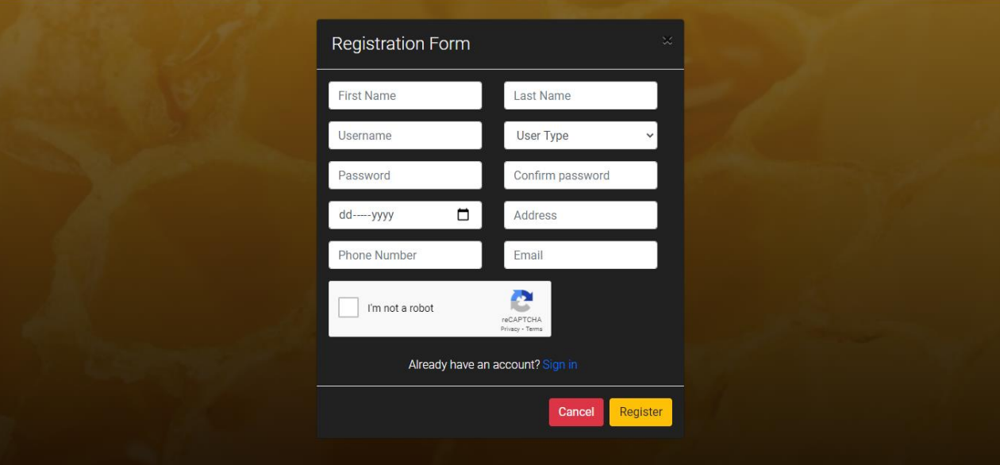
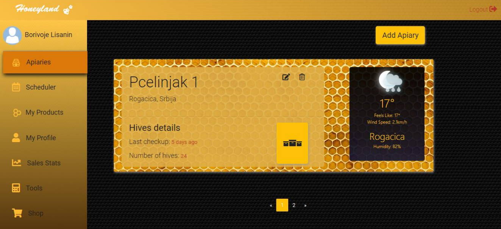

# Honeyland

## Overview

Welcome to **Honeyland**! This is a Spring Boot and Angular 10 web app that helps beekeepers manage their work and sell their products. In addition, there is also an E-Commerce app for buyers included.

## Features

- Apiary Management
- Scheduler
- Tools
- Web Shop
  
## Screenshots

### Login/Registration Page

_Description: Login and registration pages allow users to log in or register on the app._

## Beekeepers

### Beekeeper Dashboard

_Description: If you registered as a beekeeper, this page will show an overview of all modules available to you, defaulting to the Apiary page._

### Apiary Page

_Description: The Apiary page lets you manage your apiaries. You can add, edit and review your apiaries, as well as organize them by managing their hives._

### Scheduler

_Description: The Scheduler page allows you to plan and manage important events such as apiary inspection, feeding, harvesting, medical treatments, etc It also allows you to publish social events such as fairs or markets._

### Products

_Description: In My Products page the beekepers can manage their products that will be added to the web shop._

### Profile Page

_Description: Profile page lets you display different information about yourself and your apiaries. You can post pictures inside your gallery._

### Sales Stats

_Description: This page displays sales statistics within the previous time period._

### Tools

_Description: Food calculator is a tool that helps you determine how much sugar and water you need for feeding based on different wather conditions and size of your hives. A tool to help you with disease discovery is panned in the future._

## Buyers

### Homepage

_Description: If you have registered as a buyer, on this page you can see all relevant events based on their time and location._

### Order History

_Description: On this page, buyers can check their order history._

## Webshop

_Description: Both beekeepers and buyers can access the webshop.Beekeepers can manage their products, while buyers can order products using their cart, as well as write reviews for purchased products.

